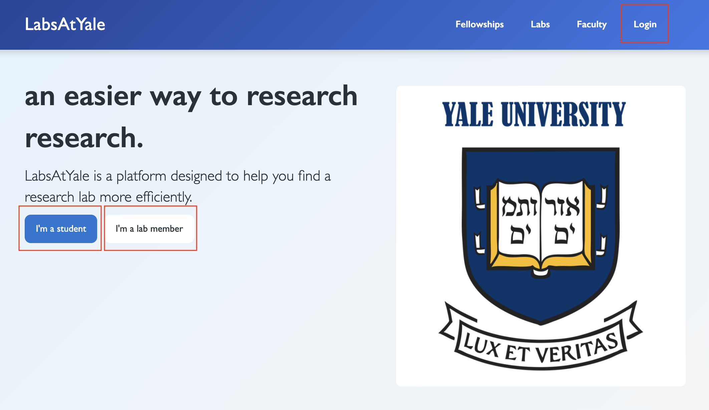
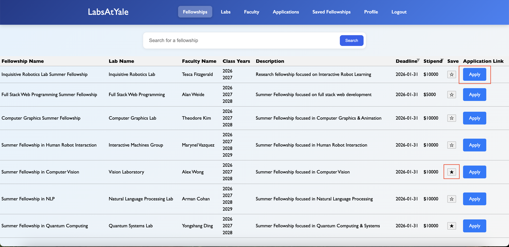
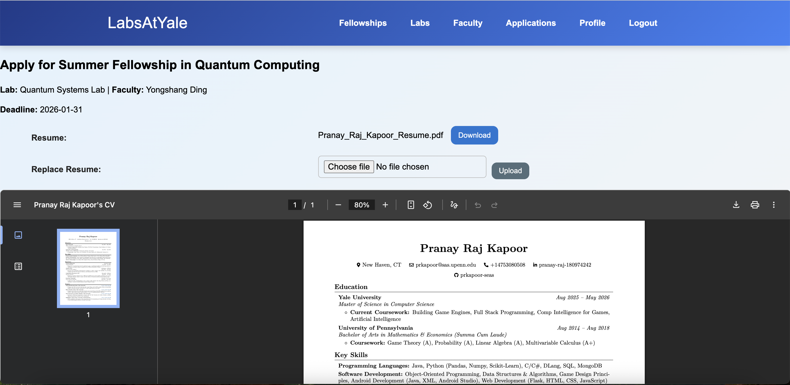
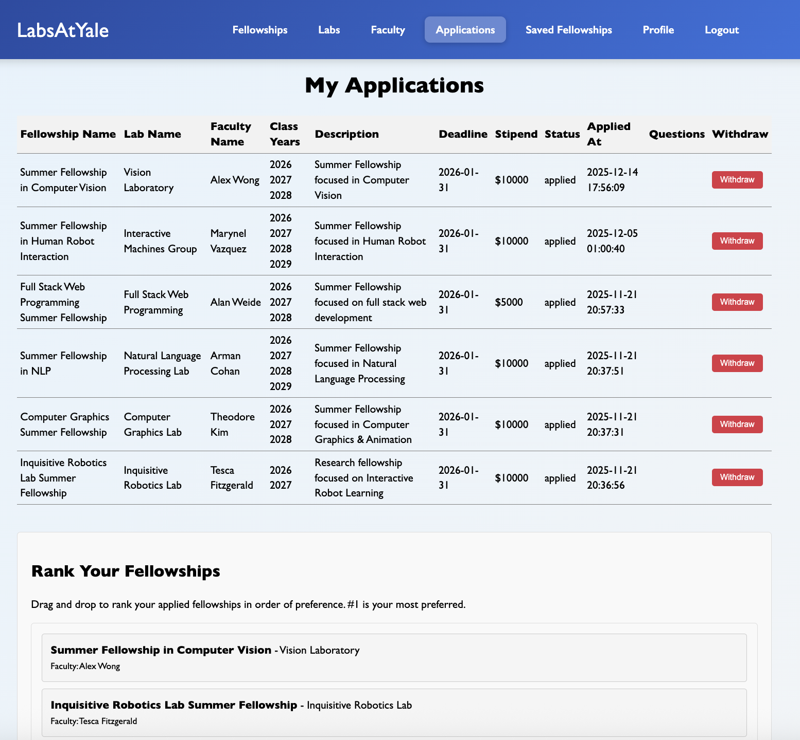
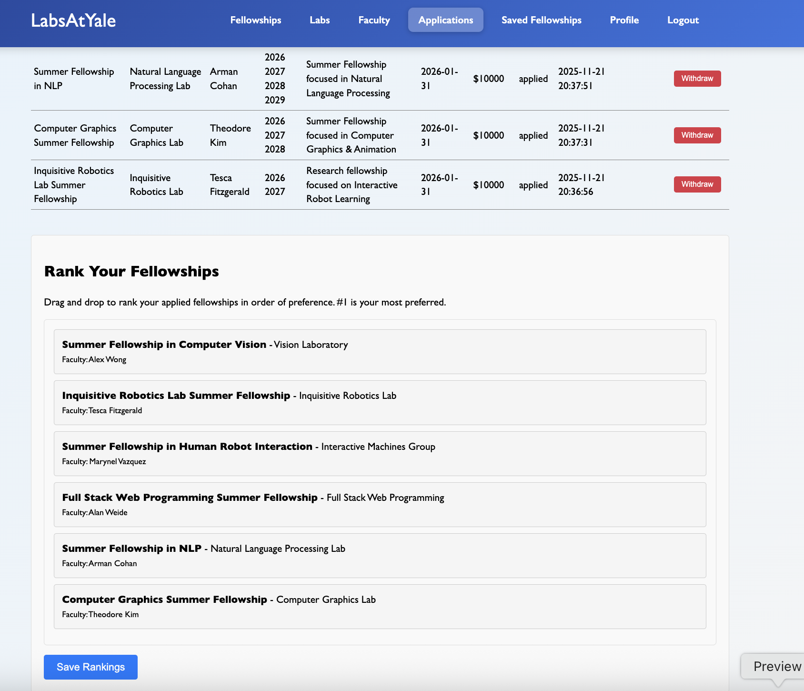
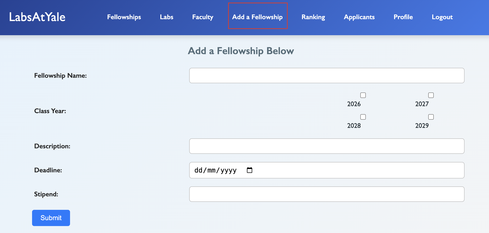
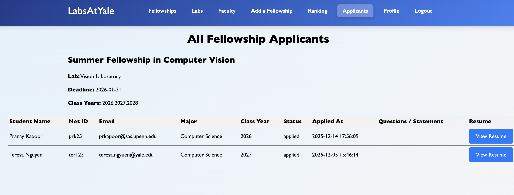
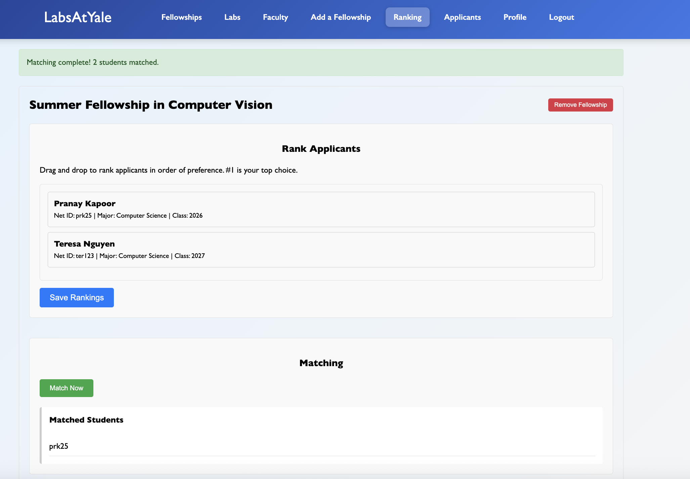
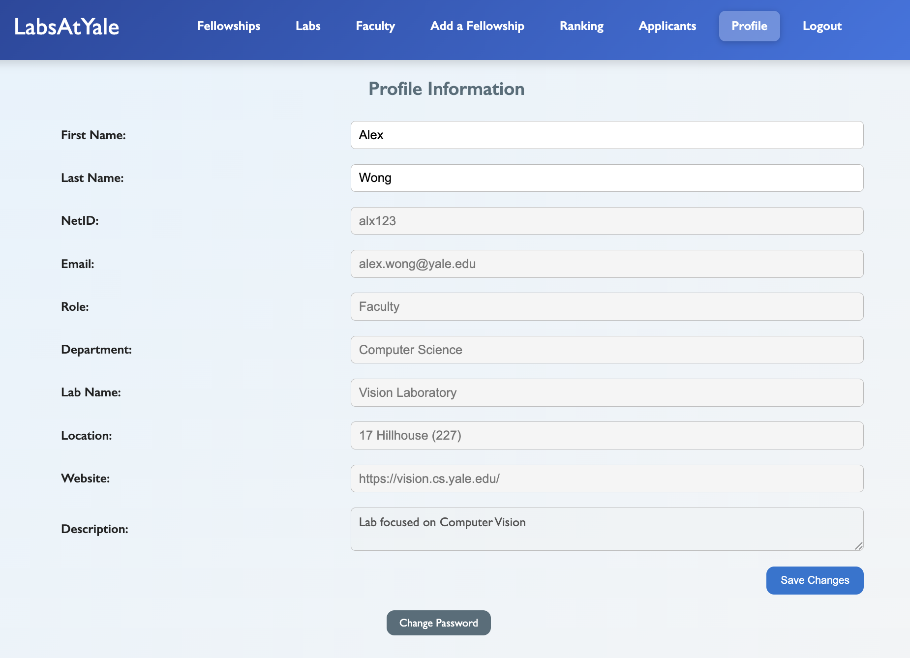

# LabsAtYale

A web application for discovering Yale research labs and fellowships, applying
to them, and matching students to fellowships through a two-sided ranking
process.

## Team

| Name | NetID |
| ---- | ----- |
| Pranay Raj Kapoor | `prk25` |
| Tina Li | `tl853` |
| Teresa Nguyen | `ttn23` |
| Emmett Seto | `exs4` |

## Architecture

The backend runs as two independent services that communicate only over HTTP.

| Folder | Service | Port | Owns |
| ------ | ------- | ---- | ---- |
| `web/` | Main Flask application (pages, auth, applications, matching) | 8080 | `labsatyale.sqlite` |
| `analytics/` | A/B variant assignment, event store, metrics API | 8000 | `ab_events.sqlite`, `ab_tests.json` |

The web app never imports the analytics code — it calls the analytics service
through `web/analytics_client.py`, and degrades gracefully (short timeouts, safe
defaults) if the service is unavailable.

```
├── web/                     main application
│   ├── fellowship.py        routes
│   ├── database.py          data access
│   ├── Users.py             model classes
│   ├── matching.py          fellowship matching algorithm
│   ├── analytics_client.py  HTTP client for the analytics service
│   ├── templates/  static/
│   ├── schema.sql  mock.sql  rank.sql
│   ├── requirements.txt  Dockerfile
├── analytics/               analytics service
│   ├── app.py               HTTP API + dashboard
│   ├── assign.py            stateless variant assignment
│   ├── store.py             SQLite event store + metrics
│   ├── ab_tests.json  schema.sql
│   ├── requirements.txt  Dockerfile  README.md
├── tests/
├── docker-compose.yml
├── pytest.ini
└── .env.example
```

## Running the application

Secrets are read from a local `.env` file (never committed). Copy the template
and fill it in:

```
cp .env.example .env
python -c "import secrets; print(secrets.token_hex(32))"   # value for APP_SECRET_KEY
```

`.env` keys: `APP_SECRET_KEY` (required), `SMTP_EMAIL` and `SMTP_PASSWORD`
(optional — outbound notification / password-reset email).

### With Docker (both services)

```
docker compose up --build
```

- Web app: http://localhost:8080
- Analytics dashboard: http://localhost:8000

### Without Docker

```
pip install -r web/requirements.txt -r analytics/requirements.txt

# terminal 1 — analytics service (run from the repo root)
python -m analytics.app

# terminal 2 — web app (run from the repo root)
ANALYTICS_URL=http://localhost:8000 python web/runserver.py 8080
```

## Using the site

You can browse fellowships, labs, and faculty without an account. To apply or
post fellowships, sign up as a student ("I'm a student") or as a lab member
("I'm a lab member"), or log in from the **Login** tab.



### Students

Logged in as a `student`, you can view and apply for fellowships, and save
fellowships to apply for later. An application takes a résumé and a personal
statement.





Submitted applications appear in the **Applications** tab, where you can withdraw
from a fellowship or rank your choices for the matching process.





### Faculty and the matching process

Faculty post fellowships from the **Add a Fellowship** tab.



Once students have applied, faculty review résumés from the **Applicants** tab.



After students rank their fellowships, faculty rank their applicants and run
**Match Now** to match students to fellowships.



### Profile

Students and faculty each have a profile page to update their information,
upload a résumé, and change their password. Students can also subscribe to new
opportunities and get an email whenever a fellowship is posted.



## A/B testing (analytics service)

The analytics service runs A/B experiments defined in `analytics/ab_tests.json`.
Each visitor gets a stable `visitor_id` cookie; the service assigns a variant by
hashing `visitor_id + test_name`, so the assignment is deterministic and needs
no stored state. The web app reports two kinds of events — a variant being shown
(`variation_presented`) and a target action being taken — and the service
aggregates them.

| Method | Path | Purpose |
| ------ | ---- | ------- |
| GET | `/` | dashboard: per-variant impressions, actions, conversion rate |
| GET | `/healthz` | health probe |
| GET | `/variant?test=<name>&visitor=<id>` | variant for one test |
| GET | `/variants?visitor=<id>` | `{test: variant}` for every test |
| POST | `/events` | record `{event, test, visitor, variant?, timestamp?}` |
| GET | `/metrics/<test>` | conversion summary as JSON |

## Tests

```
pip install -r web/requirements.txt
pytest
```

`pytest.ini` puts `web/` and the repo root on the path so both services' modules
import cleanly.
